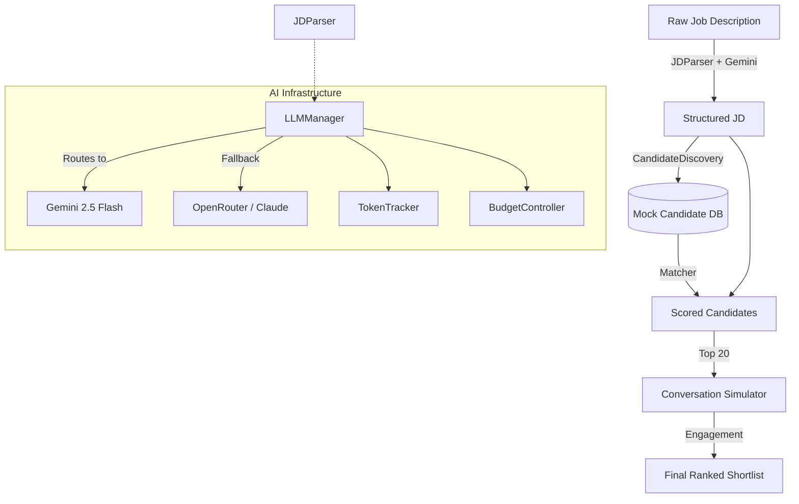

# 🎯 AI Talent Scouting Agent

An AI-powered tool for recruiters that automates the talent scouting pipeline. It parses free-form job descriptions, discovers candidates, matches them against the JD, and simulates a conversational outreach to gauge their interest level. 

Built for the **Deccan AI Hackathon 2026**.

---

## 🏗️ Architecture

The system uses a 5-step pipeline, orchestrated by `agent/core.py` and served via FastAPI:



---

## 🚀 Quick Setup (Max 5 Steps)

1. **Clone & Virtual Environment**
   ```bash
   python3 -m venv venv
   source venv/bin/activate
   ```

2. **Install Dependencies**
   ```bash
   pip install -r requirements.txt
   ```

3. **Configure Environment**
   ```bash
   cp .env.example .env
   ```
   Add your `GEMINI_API_KEY` to the `.env` file. By default, `LLM_DRY_RUN=true` is set. Change to `false` to enable live LLM calls.

4. **Start the Demo (API + UI)**
   ```bash
   bash run.sh
   ```

5. **Open the App**
   Navigate to `http://localhost:8501` in your browser.

---

## 🧮 Scoring Logic

The final combined score is weighted **60% Match + 40% Interest**.

### 1. Match Score (Max 100 points)
Calculated via `agent/matcher.py`:
* **Skills (40 pts):** Based on the overlap between JD required/nice-to-have skills and the candidate's skills.
* **Experience (25 pts):** Match between required seniority level (junior/mid/senior/staff) and candidate's years of experience.
* **Location (15 pts):** Alignment on remote vs. onsite preferences.
* **Culture (20 pts):** Semantic alignment between JD culture signals and candidate's summary.

### 2. Interest Score (Max 100 points)
Calculated via `agent/conversation.py` through a simulated 3-turn chat:
* **Personality Baseline:** Eager (78 pts), Cautious (48 pts), Passive (18 pts).
* **Response Speed:** Fast (+12 pts), Medium (+6 pts).
* **Availability:** Open to opportunities (+8 pts).

---

## 🔌 API Documentation

The backend runs on FastAPI at `http://localhost:8000`. Full OpenAPI docs are available at `http://localhost:8000/docs`.

### `POST /scout`
Run the full talent scouting pipeline.

**Request:**
```json
{
  "job_description": "Senior Python Engineer needed with Django/FastAPI, PostgreSQL, Docker, and AWS."
}
```

**Response:**
```json
{
  "job_title": "Senior Python Engineer",
  "experience_level": "senior",
  "location_type": "remote",
  "required_skills": ["python", "django", "fastapi", "postgresql", "docker", "aws"],
  "total_candidates_reviewed": 50,
  "candidates_engaged": 20,
  "shortlist": [
    {
      "rank": 1,
      "candidate_id": "CAND001",
      "name": "Sarah Chen",
      "title": "Senior Backend Engineer",
      "match_score": 88.5,
      "interest_score": 98.0,
      "combined_score": 92.3,
      "strengths": ["Python", "Django", "FastAPI"],
      "gaps": ["React"]
    }
  ],
  "timestamp": "2026-04-26T12:00:00Z"
}
```

### `GET /health`
System liveness and config check.

### `GET /stats`
Token usage and LLM provider statistics.

---

## 🎥 Demo

*Watch the 2-minute walkthrough on [YouTube (Placeholder)](#).*
